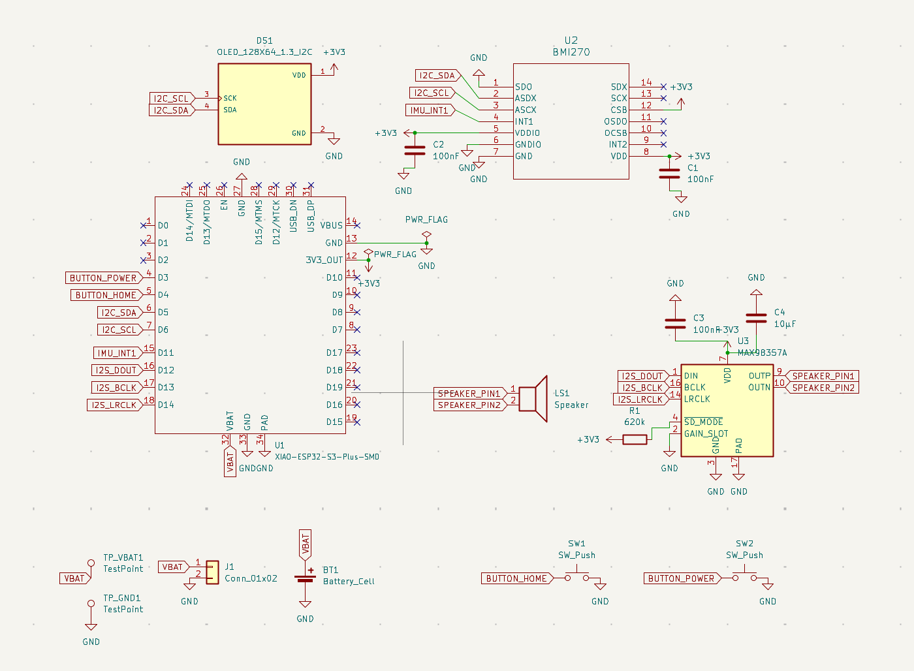
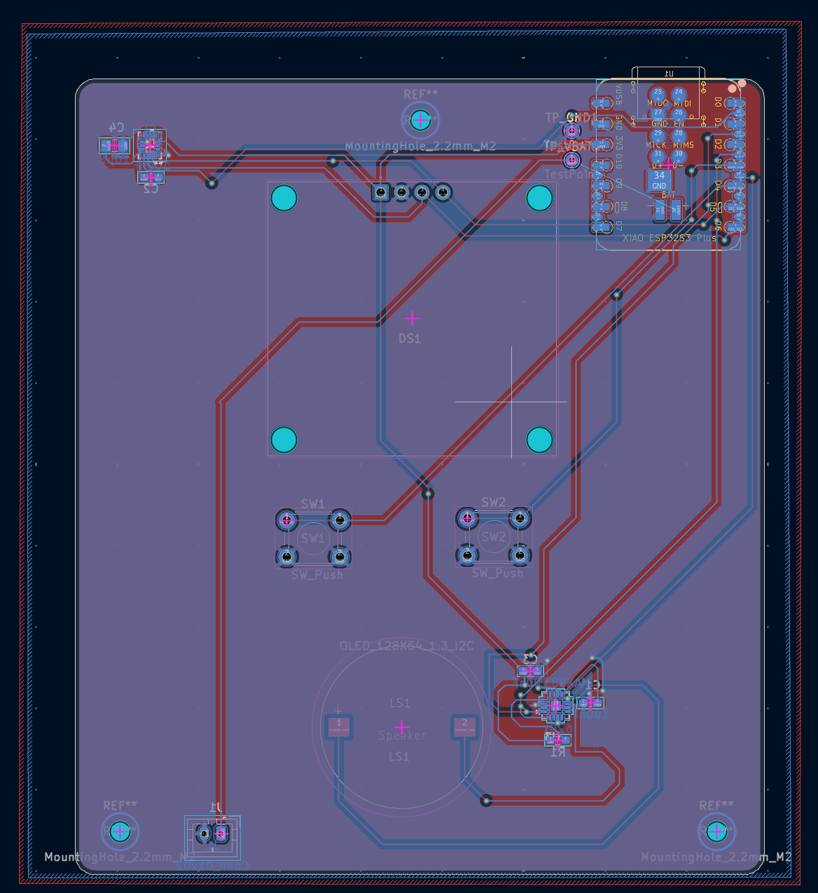
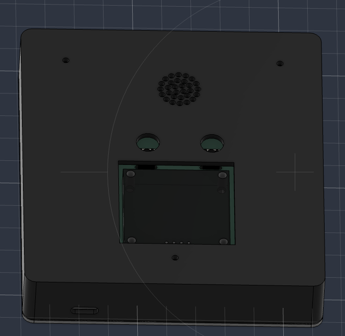

# Lethe

Lethe is an educational device aimed at reducing student's screen times by using a speaker to ask questions / convey informations, and using tilts to get user input.

## How it works
- load flashcard sets or MCQ sets onto the ESP32's USB-C connector (it must be in the JSON format expected by Lethe)
- select the flashcard set or MCQ set on the device by tilting through the list of all sets
- if in MCQ mode, a question will be spoken and each different direction responds an option, so to answer you tilt the device in a direction.
- the round will keep on going until all of the questions have been answered correctly
- if in flashcard mode, each flashcard's front side will be spoken out loud
- you can tilt up and down to flip the card and read the other side
- then you tilt left/right to signal whether you want it to be repeated or not

## Inspiration and component reasoning

I made it because high screen time is a problem I face myself, and this device means I can move around while studying. I also wanted to experiment and see if listening rather than reading helps to remember stuff more or not.

Some of the components I'm using and why:
- Seeed Studio XIAO ESP32-S3 Plus rather than not Plus because it has higher Flash and I'm using that to store all the flashcard sets.
- OLED display rather than a colour one because the screen will not be in use during the actual modes because I want the user to focus on sound rather than screens.
- An IMU (BMI270) so that I can accurately detect motions like tilting and flicking in all directions. This means I can use gestures instead of button clicking for user input.
- 1000 mAh LiPo Battery so that there is a reasonable battery life (5 hours) but it doesn't take too long to charge (10 hours).
- JST-PH 2-pin connector so that I can change the battery without needing to remove the solder.

## Hardware
This repository contains all the hardware files you would need to replicate this project. The PCB + schematics was done in the KiCad, and the enclosure was designed in Fusion 360.

The [`pcb-files`](pcb-files) folder contains the KiCad source files (`.kicad_sch`, `.kicad_pro`, `.kicad_pcb`) and the `gerbers.zip` which was used to manufacture the PCB.

The [`cad-files`](cad-files) folder contains `.step`, `.stl` and .`f3d` files for both the top and bottom cases of the enclosure for lethe.
## Firmware
There are 2 main components of the firmware: the code that will be uploaded onto the ESP32, and the code that will be used to transmit json sets on the user's device to the ESP32 when connected to the user's device via USB-C.

Both are located in the [`firmware-files`](firmware-files) folder: `lethe.ino` refers to the ESP32 code, and `upload.py` refers to the file transmission code.

## Images
This is what the schematic looks like:

This is what the PCB looks like:

This is what the enclosure (top and bottom case) looks like:

## BOM
Also in the [BOM.csv](BOM.csv) file.

| Name                            | Quantity | Link To Buy                                                                                                                                             | Cost (USD)               |
|---------------------------------|:--------:|---------------------------------------------------------------------------------------------------------------------------------------------------------|--------------------------|
| Seeed Studio XIAO ESP32-S3 Plus |    1     | [Seeed Studio](https://www.seeedstudio.com/Seeed-Studio-XIAO-ESP32S3-Plus-p-6361.html?srsltid=AfmBOooQTaGGdCkQ02MIjwHmLjggawnlMzKeWbwjh-_6AZfB2T0bQeFj) | $7.90 (+$3.80 shipping)  |
| Bosch BMI270                    |    1     | [LCSC](https://www.lcsc.com/product-detail/C2836813.html?s_z=n_q_x_BMI270)                                                                              | $3.64                    |
| MAX98357A                       |    1     | [LCSC](https://www.lcsc.com/product-detail/C910544.html)                                                                                                | $1.34                    |
| 1.3" SH1106 OLED                |    1     | [AliExpress](https://www.aliexpress.com/item/1005006099414855.html)                                                                                     | $4.17 (shipping unknown) |
| JST-PH 2-pin Connector          |    1     | [LCSC](https://www.lcsc.com/product-detail/C131337.html)                                                                                                | $0.71 for 20             |
| 20 mm 8Ω Speaker                |    1     | [LCSC](https://www.lcsc.com/product-detail/C28642279.html)                                                                                              | $0.85                    |
| Button                          |    2     | [LCSC](https://www.lcsc.com/product-detail/C393938.html)                                                                                                | $0.97 for 50             |
| 620 kΩ Resistor                 |    1     | [LCSC](https://www.lcsc.com/product-detail/C2096268.html)                                                                                               | $0.01                    |
| 100 nF Ceramic Capacitor        |    3     | [LCSC](https://www.lcsc.com/product-detail/C92490.html)                                                                                                 | $1.81 for 50             |
| 10 µF Ceramic Capacitor         |    1     | [LCSC](https://www.lcsc.com/product-detail/C17024.html)                                                                                                 | $1.95 for 20             |
| 1000 mAh LiPo Battery           |    1     | [AliExpress](https://www.aliexpress.com/item/1005009294502730.html)                                                                                     | $6.87                    |